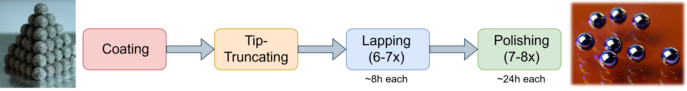
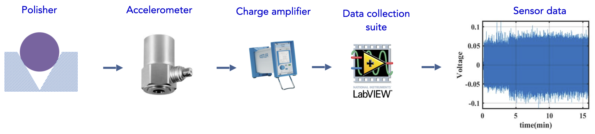
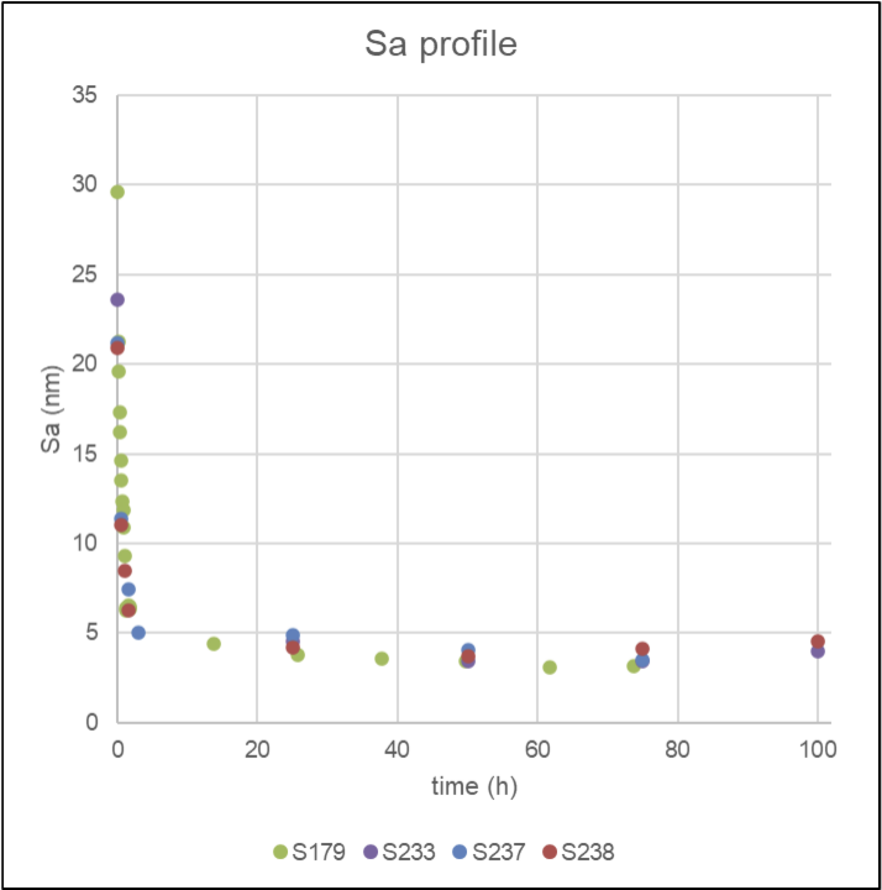

__Authors__: Antonios Alexos, Junze Liu, Shashank Galla, Sean Hayes, Kshitij Bhardwaj, Alexander Schwartz, Monika Biener, Pierre Baldi, Satish Bukkapatnam, Suhas Bhandarkar

- [Downloading Dataset](#downloading-dataset)
- [Dataset Descriptions](#dataset-descriptions)
- [Data Details](#data-details)
- [License](#license)
- [Citation](#citation)
- [Acknowledgements](#acknowledgements)

### Downloading Dataset
The data is accessible through [Google Drive](https://drive.google.com/drive). The polishing runs are divided and stored as training data and test data. The training data include polishing runs: S173, S179, and S211. The test data include: S233 and S238.

### Dataset Descriptions
We test and adapt separately for each of the testing data due to the domain adapatation approach. For the S173, S211, and S233 we use polishing 1 run (≈ 25 hours) where only start/end Sa values are known; we break the 25-hour into 6 minute samples and determine intermediate Sa values assuming linear change for 1st hour and log change for the remaining hours. For the S179 we use polishing 1 run which is 12 hours long where only start/end Sa values known so break the 12 hours into 6min samples, and determine intermediate Sa values assuming log change. For the S238 we use polishing 1,2,3 runs which are 30 minutes long each while polishing 4 run is 23.5 hours long. We assume linear decline in the first 2 runs, and log decline for the rest.

### Data Details

High-density carbon (HDC) was deposited in a microwave plasma-enhanced CVD (MPECVD) reactor. After coating, capsules were polished in a proprietary-design v-groove polisher with a diamond grinding disk as described in previous work. During the polishing process, the instrument was stopped periodically to inspect the surface roughness of the HDC capsule. An accelerometer (Kistler K-Shear 8702B500) was attached to the polishing motor body using dental epoxy in order to collect vibrational data from the process. The accelerometer data was collected via a computer-connected amplifier and controlled using custom software written in Labview. Data was generated as a voltage vs. time signal. 


For the baseline polishing, two batches were polished in and measured using standard conditions to complete the baseline dataset. The first batch underwent polishing in 24 hour increments over a total of four stages. At each stage, accelerometer sensor data was collected at a 10kHz sampling rate. Data was collected over the entire run, generating 24 hour time-series datasets. Additionally, a second batch was polished with extra focus on the early-in-time changes to the surface morphology. The polishing process was interrupted every 0.1 hours and shells were removed from the polisher, cleaned by sonication in solvent, and surface roughness data was collected. A total of 18 0.1 hour accelerometer/surface roughness data pairs were collected before the batch was subsequently polished for an additional 72 hours in 12 hour increments.

For the test polishing, a total of three batches were polished to generate the test dataset. Each batch was polished using the same coating and polishing conditions as the baseline batches and vibrational data was collected. The three batches were each polished for 96-100 hours in 24 or 25 hour increments. For one of the batches, surface roughness data was collected every 30 minutes over 1.5 hours and paired with a vibrational spectra dataset to collect early-in-time changes.  

The progress of the surface roughness during the polishing process S179, S233, S237, and S238 is visualized as:


### License

Creative Commons Attribution v4

### Citation
```
    XXXX
```
### Acknowledgements
This work was performed under the auspices of the U.S. Department of Energy by LLNL under contract DE-AC52 -07NA27344 and was supported by the LLNL laboratory-directed research and
development (LDRD) program under project 23-ERD-014. We would also like to thank Dan Clark
from Lawrence Livermore National Lab (LLNL) for his inputs and for generating Figure 3 and
Juergen Biener (LLNL) and Christoph Wild from Diamond Materials GmBH for many helpful
discussions.
